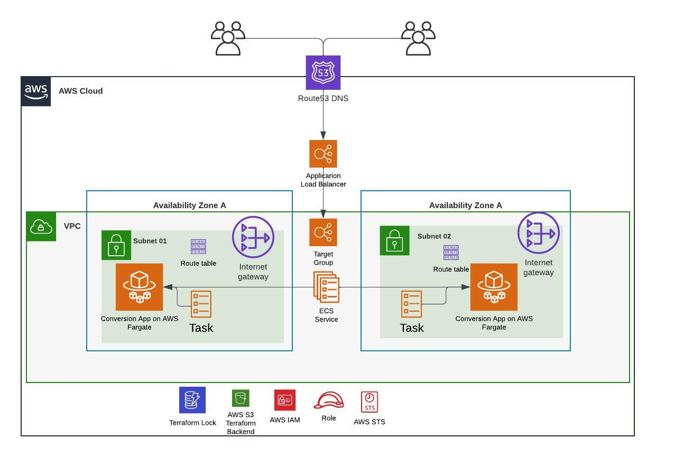
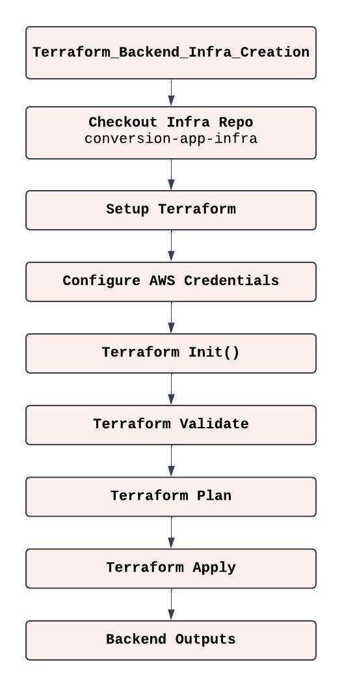

# conversion-app-infra
This Repo supports the creation of Backend ECS Cluster for the deployment of the Conversion Application.

## Architecture Description

- **VPC**: A Virtual Private Cloud (VPC) to host all the resources.
- **Subnets**: Two public subnets for deploying ECS tasks.
- **Internet Gateway**: An Internet Gateway to allow internet access to the VPC.
- **Route Table**: A route table associated with the subnets to route traffic through the Internet Gateway.
- **Security Groups**: Security groups to control inbound and outbound traffic for the ECS tasks and load balancer.
- **Load Balancer**: An Application Load Balancer (ALB) to distribute incoming traffic to the ECS tasks.
- **Target Group**: A target group associated with the ALB to route traffic to the ECS tasks.
- **ECS Cluster**: An ECS cluster to manage the ECS tasks.
- **ECS Task Definition**: A task definition specifying the container configuration.
- **ECS Service**: An ECS service to manage the deployment and scaling of the ECS tasks.
- **IAM Roles and Policies**: IAM roles and policies to grant necessary permissions to the ECS tasks.

## Architecture Diagram

## GitHub Actions Workflow

**Workflow**: **Terraform_Backend_Infra_Creation**

This Workflow creates backend Infrastructure for storing the Terraform State file and this workflow needs to be run **ONLY ONCE** by the infrastructure team. Dev teams will not have permission to run this workflow.

To run **Terraform_Backend_Infra_Creation** navigate to GitHub Actions Tag and RUN the workflow for the  **main** branch

**NOTE: NO NEED TO RUN THE WORKFLOW IF BACKEND (S3 & DYNAMODB) IS ALREDY CREATED IN AWS**

To Run the worlflow for New AWS Account / Backend please follow below Process:

1. Generate **AWS_ACCESS_KEY_ID** and **AWS_SECRET_ACCESS_KEY** for the new AWS Account with Admin role and AWS CLI Access.
2. Update above keys in the **Github** >> **Setting** >> **Security** >> **Secrets and Variables** >> **Action** >> **Secrets** accordingly.
3. Update **S3 Bucket Name** and **DynamoDB Name** in the file **conversion-app-infra/backend-infra-prerequisites/terraform.tfvars**.
4. Ensure that the same **S3 bucket Name** and **DynamoDB Name** is updated in the file  **conversion-app-infra/ecs-fargate-cluster/terraform.tfvars**
5. Merge both the changes to the **main** branch.
6. Run the workflow **Terraform_Backend_Infra_Creation** form the Github Actions Tab for the **main** branch.